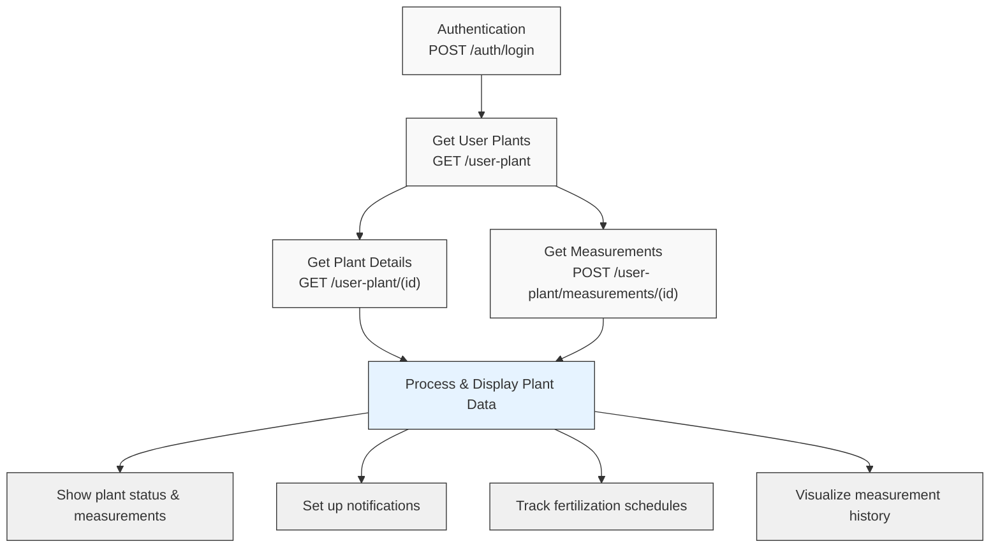

# FYTA Public API

## Table of Contents
- [Authentication](#auth-api)
- [API Endpoints](#api-endpoints)
  - [Get User Plants](#get-user-plants)
  - [Get Plant Details](#get-details-by-user-plant-id)
  - [Get Measurements History](#get-measurements-by-user-plantid)
- [Status Codes](#status-codes)
  - [Plant Status](#fyta-user-plant-status)
  - [Measurement Status](#fyta-measurement-status)
  - [Sensor Status](#fyta-sensor-status)
  - [Hub Status](#fyta-hub-status)
  - [Wifi Status](#fyta-wifi-status)
  - [Temperature Unit](#fyta-temperature-unit)
- [Measurement Units Reference](#measurement-units-reference)
- [API Flow Diagram](#api-flow-diagram)
  - [Typical Implementation Flow](#typical-implementation-flow)
- [Data Structures](#data-structures)
  - [Plant Object](#plant-object)
  - [Garden Object](#garden-object)
  - [Sensor Object](#sensor-object)
  - [Hub Object](#hub-object)
  - [Fertilisation Object](#fertilisation-object)
  - [Notifications Object](#notifications-object)
  - [Device Menu Object](#device-menu-object)
  - [Owner Object](#owner-object)

## Auth API

URL: [https://web.fyta.de/api/auth/login](http://web.fyta.de/api/auth/login)

Method: POST

Body:

```json
{
    "email": "example@example.com",
    "password": "examplepassword"
}
```

Response:

```json
{
    "access_token": "111111111111111111111111111111111111111",
    "token_type": "Bearer",
    "expires_in": 5184000,
    "refresh_token": "2222222222222222222222222222222222222222",
    "scope": "mobile"
}
```

The requests below require a Bearer authentication token.

## API Endpoints

### Get User Plants

URL: [https://web.fyta.de/api/user-plant](https://web.fyta.de/api/user-plant)

Method: GET

Response:

```json
{
  "gardens": [
    {
      "id": 123,
      "garden_name": "Home",
      "origin_path": null,
      "thumb_path": null,
      "mac_address": null
    }
  ],
  "plants": [
    {
      "id": 12,
      "nickname": "Ficus benjamina 1",
      "scientific_name": "Ficus benjamina",
      "status": 2,
      "plant_id": 201,
      "family_id": null,
      "wifi_status": 1,
      "thumb_path": "<url>",
      "origin_path": "<url>",
      "plant_thumb_path": "<url>",
      "plant_origin_path": "<url>",
      "received_data_at": "2023-01-00 10:10:00",
      "temperature_optimal_hours": 22,
      "light_optimal_hours": 0,
      "temperature_status": 2,
      "light_status": 1,
      "moisture_status": 3,
      "salinity_status": 2,
      "garden": {
        "id": 123
      },
      "sensor": {
        "id": "AA:AA:AA:2B:AF:F4",
        "has_sensor": true,
        "status": 1,
        "uuid_android": null,
        "uuid_ios": "4AAAAAA6F-0457-3233-8A43-032B5377E763",
        "version": "0.30.0",
        "is_battery_low": false,
        "received_data_at": "2023-01-01 10:10:00"
      },
      "hub": {
        "id": 123,
        "hub_id": "AA:AA:AA:27:7D:6A",
        "status": 1,
        "received_data_at": "2023-01-01 01:10:01",
        "reached_hub_at": "2023-01-01 10:10:01"
      }
    }
  ]
}
```

## Get Details by User Plant ID

URL: [https://web.fyta.de/api/user-plant/[plantID]](https://web.fyta.de/api/user-plant/%5BplantID%5D)

Method: GET

```json
{
  "plant": {
    "id": 12,
    "nickname": "Ficus benjamina 1",
    "scientific_name": "Ficus benjamina",
    "genus": null,
    "status": 2,
    "plant_id": 201,
    "family_id": null,
    "thumb_path": "<url>",
    "origin_path": "<url>",
    "plant_thumb_path": "<url>",
    "plant_origin_path": "<url>",
    "received_data_at": "2023-01-01 10:10:01",
    "gathering_data": false,
    "is_illegal": false,
    "not_supported": false,
    "sensor_update_available": false,
    "garden": {
      "id": 123,
      "name": "Home"
    },
    "sensor": {
      "id": "AA:AA:AA:2B:AF:F4",
      "has_sensor": true,
      "status": 1,
      "uuid_android": null,
      "uuid_ios": "AAAAA6BF-0457-3233-8A43-032B5377E763",
      "version": "0.30.0",
      "is_battery_low": false,
      "received_data_at": "2023-01-01 10:10:00",
      "created_at": "2022-01-01 01:10:10"
    },
    "hub": {
      "id": 123,
      "hub_id": "AA:AA:AA:27:7D:6A",
      "status": 1,
      "received_data_at": "2023-01-00 10:10:00",
      "reached_hub_at": "2023-01-00 10:10:00"
    },
    "measurements": {
      "ph": {
        "status": null,
        "values": {
          "min": "4",
          "max": "7",
          "current": null
        },
        "unit": "pH",
        "absolute_values": {
          "min": "0",
          "max": "7.5",
          "minText": "0",
          "maxText": "7.5"
        }
      },
      "temperature": {
        "type": "temperature",
        "status": 2,
        "values": {
          "min_good": "17",
          "max_good": "36",
          "min_acceptable": "10",
          "max_acceptable": "42",
          "current": "18",
          "currentFormatted": "18",
          "optimal_hours": 22
        },
        "unit": "°C/h", // Note: Despite "/h" suffix, this is an instantaneous measurement in °C
        "absolute_values": {
          "min": "0",
          "max": "50",
          "minText": "0",
          "maxText": "50"
        }
      },
      "light": {
        "type": "light",
        "status": 1,
        "values": {
          "min_good": "20",
          "max_good": "450",
          "min_acceptable": "18",
          "max_acceptable": "675",
          "current": "2",
          "currentFormatted": "2",
          "optimal_hours": 0
        },
        "dli_values": {
          "min_good": "0.25",
          "max_good": "9",
          "min_acceptable": "0.06",
          "max_acceptable": "9"
        },
        "unit": "μmol/s", // Note: Should be interpreted as PPFD (μmol/s·m²)
        "dli_unit": "mol/day",
        "absolute_values": {
          "min": "0",
          "max": "700",
          "minText": "0",
          "maxText": "700"
        }
      },
      "moisture": {
        "type": "moisture",
        "status": 3,
        "values": {
          "min_good": "35",
          "max_good": "70",
          "min_acceptable": "25",
          "max_acceptable": "80",
          "current": "61",
          "currentFormatted": "61"
        },
        "unit": "%/h", // Note: Despite "/h" suffix, this is an instantaneous measurement in %
        "absolute_values": {
          "min": "0",
          "max": "85",
          "minText": "0",
          "maxText": "85"
        }
      },
      "salinity": {
        "type": "salinity",
        "status": 2,
        "values": {
          "min_good": "0.6",
          "max_good": "1",
          "min_acceptable": "0.4",
          "max_acceptable": "1.2",
          "current": "1",
          "currentFormatted": "0.50"
        },
        "unit": "mS/cm/h", // Note: Despite "/h" suffix, this is an instantaneous measurement in mS/cm
        "absolute_values": {
          "min": "0",
          "max": "1.4",
          "minText": "0",
          "maxText": "1.4"
        }
      },
      "battery": "100"
    },
    "temperature_unit": 1,
    "know_hows": []
  }
}
```

## Get Measurements by User PlantID

[https://web.fyta.de/api/user-plant/measurements/[plantID]](https://web.fyta.de/api/user-plant/measurements/%5BplantID%5D)

Method: POST

Body:

```json
{
  "search": {
    "timeline": "week"
  }
}
```

Accepted timeline values: "hour", "day", "week", "month", defaulting to month

Response:

```json
{
  "measurements": [
    {
      "light": 1,
      "temperature": 18,
      "soil_moisture": 61,
      "soil_moisture_anomaly": false,
      "soil_fertility": 0.5,
      "soil_fertility_anomaly": false,
      "date_utc": "2023-01-01 01:00:00"
    }
    ..... 
  ],
  "dli_light": [
    {
      "dli_light": 0.04,
      "date_utc": "2023-01-01 00:00:00"
    },
    ..... 
  ],
  "absolute_values": {
    "light": {
      "min": "0",
      "minText": "0",
      "max": "700",
      "maxText": "700"
    },
    "dli_light": {
      "min": "0",
      "minText": "0",
      "max": "12.0",
      "maxText": "12.0"
    },
    "temperature": {
      "min": "0",
      "minText": "0",
      "max": "50",
      "maxText": "50"
    },
    "soil_moisture": {
      "min": "0",
      "minText": "0",
      "max": "85",
      "maxText": "85"
    },
    "soil_fertility": {
      "min": "0",
      "minText": "0",
      "max": "1.4",
      "maxText": "1.4"
    }
  },
  "thresholds": {
    "ph_min": 4,
    "ph_max": 7,
    "temperature_min_good": 17,
    "temperature_max_good": 36,
    "temperature_min_acceptable": 10,
    "temperature_max_acceptable": 42,
    "light_min_good": 20,
    "light_max_good": 450,
    "light_min_acceptable": 18,
    "light_max_acceptable": 675,
    "dli_light_min_good": 0.25,
    "dli_light_max_good": 9,
    "dli_light_min_acceptable": 0.06,
    "dli_light_max_acceptable": 9,
    "moisture_min_good": 35,
    "moisture_max_good": 70,
    "moisture_min_acceptable": 25,
    "moisture_max_acceptable": 80,
    "salinity_min_good": 0.6,
    "salinity_max_good": 1,
    "salinity_min_acceptable": 0.4,
    "salinity_max_acceptable": 1.2
  }
}
```

## FYTA User Plant Status

Field `status` represents overall plant status.

| **Value** | **Description** |
| --- | --- |
| 0 | User Plant deleted |
| 1 | User Plant good status |
| 2 | User Plant bad status |
| 3 | User Plant no sensor |

## FYTA Measurement Status

Field `status` represents current measurement for **light**, **temperature**, **moisture**, **salinity** status.

| **Value** | **Description** |
| --- | --- |
| 0 | No Data |
| 1 | Too Low |
| 2 | Low |
| 3 | Perfect |
| 4 | High |
| 5 | Too High |

## FYTA Sensor Status

Field `status` represents sensor status.

| **Value** | **Description** |
| --- | --- |
| 0 | none - When plant does not have sensor |
| 1 | correct - When plant has sensor, last measurement was less than 1,5h ago OR measurement wasn't sent but sensor was created less than 1,5h ago |
| 2 | error - When measurement wasn't sent, when measurement was sent more than 1,5h ago |

## FYTA Hub Status

Field `status` represents Hub status.

| **Value** | **Description** |
| --- | --- |
| 1 | correct - when plant has sensor, last measurement was sent by hub, last measurement was less than 1,5h ago |
| 2 | error - last measurement is more than 1,5h ago |

## FYTA Wifi Status

Field `wifi_status` represents wifi status.

| **Value** | **Description** |
| --- | --- |
| null | Never connected to any hub or user doesnt have any hub or plant doesnt have sensor |
| 0 | Lost connection to all previously connected hubs |
| 1 | Is connected to at least one hub |
| 2 | Error in connecting hub OR hub connection lost within a specific time range |

## FYTA Temperature unit

Field `temperature_unit` represents unit system.

| **Value** | **Description** |
| --- | --- |
| 1 | Celsius |
| 2 | Fahrenheit |

## Measurement Units Reference

The following table provides guidance on how to correctly interpret the measurement units returned by the API:

| **API Unit** | **Correct Scientific Unit** | **Description** |
| --- | --- | --- |
| μmol/s | μmol/s·m² (PPFD) | Photosynthetic Photon Flux Density - instantaneous light measurement |
| mol/day (DLI) | mol/m²·day | Daily Light Integral - accumulated light over a day |
| °C/h | °C | Temperature in Celsius - instantaneous measurement |
| %/h | % | Soil moisture percentage - instantaneous measurement |
| mS/cm/h | mS/cm | Electrical conductivity - instantaneous measurement |

When displaying these values to users, developers should use the correct scientific units rather than the API notation to avoid confusion.

## API Flow Diagram

The following diagram illustrates the typical flow of API calls and how the endpoints relate to each other in a FYTA integration:



### Typical Implementation Flow

1. **Authentication**: Start by authenticating with the FYTA API to obtain an access token
2. **Get User Plants**: Retrieve the list of all plants associated with the user account
3. **Get Plant Details**: For each plant of interest, fetch detailed information
4. **Get Measurement History**: For specific plants, retrieve historical measurement data
5. **Process Data**: Handle the data according to your application needs, considering the unit conversions noted in the [Measurement Units Reference](#measurement-units-reference)

This flow allows applications to efficiently retrieve and display relevant plant data while minimizing unnecessary API calls.

## Data Structures

> **⚠️ Important Note for Developers: Measurement Unit Inconsistencies**
>
> The FYTA API contains several unit notation inconsistencies that don't follow standard scientific conventions:
> 
> - Units appended with "/h" (e.g., "°C/h", "%/h", "mS/cm/h") suggest hourly rates when they are actually instantaneous measurements
> - The PPFD light measurement unit should be "μmol/s·m²" (including the area component) rather than just "μmol/s"
> 
> These inconsistencies are maintained in this documentation to match the API responses, but developers should interpret values accordingly.

### Plant Object

The Plant object contains comprehensive information about a user's plant.

| Field | Type | Description |
| --- | --- | --- |
| id | integer | Unique identifier for the user plant |
| airtable_id | integer | Reference ID in Airtable database |
| nickname | string | User-defined name for the plant |
| scientific_name | string | Scientific name of the plant |
| genus | string | Genus of the plant |
| status | integer | Overall plant status (see [Plant Status](#fyta-user-plant-status)) |
| plant_id | integer | Reference to the plant type |
| family_id | integer | Plant family identifier |
| is_shared | boolean | Whether the plant is shared with other users |
| pot_size | integer | Size of the pot in centimeters |
| drainage | integer | Drainage level |
| light_factor | float | Factor used for light measurements calibration |
| soil_type_id | integer | Type of soil used |
| thumb_path | string | URL to thumbnail image |
| origin_path | string | URL to original image |
| plant_thumb_path | string | URL to plant species thumbnail |
| plant_origin_path | string | URL to plant species original image |
| received_data_at | string | Timestamp of last received data |
| gathering_data | boolean | Whether the plant is currently gathering data |
| is_illegal | boolean | Whether the plant is illegal in the user's jurisdiction |
| not_supported | boolean | Whether the plant is supported by FYTA |
| sensor_update_available | boolean | Whether a sensor update is available |
| location | string | Location description |
| verification | boolean | Verification status |
| is_productive_plant | boolean | Whether it's a productive plant |
| dismissed_sensor_message_at | string | Timestamp when sensor message was dismissed |
| temperature_unit | integer | Temperature unit preference (see [Temperature Unit](#fyta-temperature-unit)) |
| know_hows | array | Knowledge resources for plant care |

### Garden Object

The Garden object represents a collection of plants in a specific location.

| Field | Type | Description |
| --- | --- | --- |
| id | integer | Unique identifier for the garden |
| garden_name/name | string | Name of the garden |
| origin_path | string | URL to original image |
| thumb_path | string | URL to thumbnail image |
| mac_address | string | MAC address of associated device |

### Sensor Object

The Sensor object contains information about the physical sensor attached to a plant.

| Field | Type | Description |
| --- | --- | --- |
| id | string | MAC address of the sensor |
| has_sensor | boolean | Whether a sensor is attached |
| status | integer | Sensor status (see [Sensor Status](#fyta-sensor-status)) |
| uuid_android | string | UUID for Android devices |
| uuid_ios | string | UUID for iOS devices |
| version | string | Firmware version |
| light_factor | float | Calibration factor for light measurements |
| probe_length_id | integer | ID for probe length type |
| moisture_factor | float | Calibration factor for moisture measurements |
| is_battery_low | boolean | Battery status |
| has_sensor_update | boolean | Whether a firmware update is available |
| received_data_at | string | Timestamp of last data reception |
| created_at | string | Timestamp of sensor creation |

### Hub Object

The Hub object represents a FYTA hub that connects sensors to the internet.

| Field | Type | Description |
| --- | --- | --- |
| id | integer | Unique identifier for the hub |
| hub_id | string | MAC address of the hub |
| hub_name | string | User-defined name for the hub |
| status | integer | Hub status (see [Hub Status](#fyta-hub-status)) |
| received_data_at | string | Timestamp of last data reception |
| reached_hub_at | string | Timestamp when the hub was last reached |

### Fertilisation Object

The Fertilisation object tracks information about plant fertilization schedule.

| Field | Type | Description |
| --- | --- | --- |
| last_fertilised_at | string | Date when the plant was last fertilized |
| fertilise_at | string | Recommended date for next fertilization |
| was_repotted | boolean | Whether the plant was repotted |

### Notifications Object

The Notifications object contains settings for different types of notifications.

| Field | Type | Description |
| --- | --- | --- |
| light | boolean | Whether light notifications are enabled |
| temperature | boolean | Whether temperature notifications are enabled |
| water | boolean | Whether watering notifications are enabled |
| nutrition | boolean | Whether nutrition notifications are enabled |

### Device Menu Object

The Device Menu object contains information about device interactions and available actions.

| Field | Type | Description |
| --- | --- | --- |
| actions | array | List of available actions |
| buttons | array | Available button interactions |
| live_mode_enabled | boolean | Whether live mode is enabled |
| diagnose_enabled | boolean | Whether diagnostics are enabled |

### Owner Object

The Owner object contains information about the plant owner.

| Field | Type | Description |
| --- | --- | --- |
| id | integer | Unique identifier for the owner |
| email | string | Email address of the owner |
| username | string | Username of the owner |